# Life Hacks
For this project, my aim was to create a site that provides users with useful life hacks that are intuitive and easy to follow. The intent of this site is to provide simple solutions to life's small difficulties and is intended for anyone who would like to learn these solutions in order to make their life eaiser.

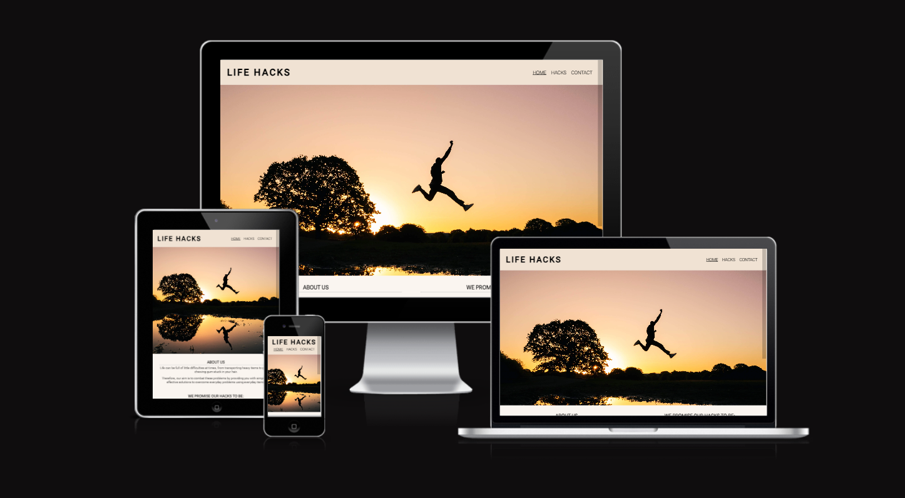

# Table of contents
- [UX](#ux)
  - [Site Purpose](#site-purpose)
  - [Site Goal](#site-goal)
  - [Audience](#audience)
  - [Communication](#communication)

- [Design](#design)
  - [Wireframes](#wireframes)
  - [Colour Scheme](#colour-scheme)
  - [Typography](#typography)
  - [Images](#images)

- [Features](#features)
  - [Existing Features](#existing-features)
  - [Future Features](#future-features)

- [Testing](#testing)
  - [Validator Testing](#validator-testing)
  - [Further Testing](#further-testing)

- [Libraries and Programs Used](#libraries-and-programs-used)

- [Deployment](#deployment)

- [Credits](#credits)
  - [Content](#content)
  - [Media](#media)


# UX
### Site Purpose
To provide intutive and easy to follow life hacks for people to follow and test for themselves.

### Site Goal
To make life eaiser by providing useful solutions to common everday problems using everday items, so anyone can follow along.

### Audience
The target audience is for people aged 18-65, but is suitable for anyone who is interested in learning new everyday life hacks.

### Communication


# Design
### Wireframes
I sketched out my wireframes by hand so I could have a visual guide as to where I would place certain elements and to overall help me structure the site.

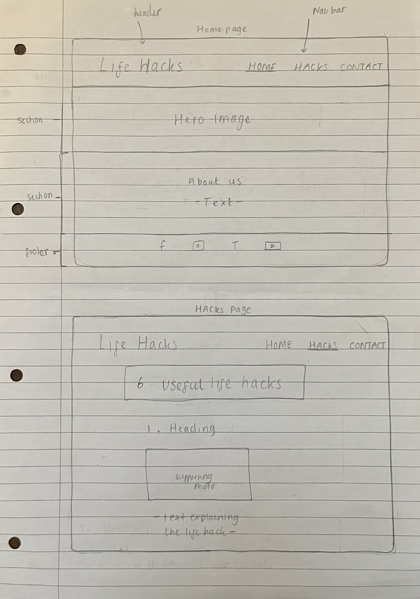
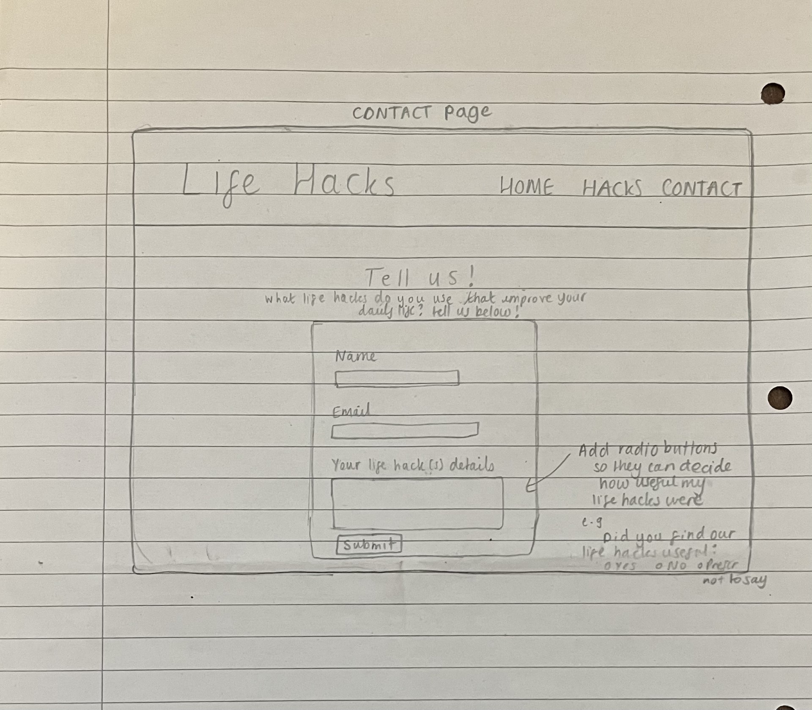

### Colour Scheme
As the main goal of the site is to make life eaiser, I decided to use shades of off-white and beige to give the site a feeling of calmness, peace and warmth to reflect this. I used [coolors.co](https://coolors.co/) to find the below colour pallete. 

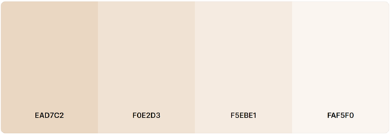

I settled on using #FAF5F0 and #F0E2D3 in this pallete to create a clear contrast between the header, main body and footer. Because of my choice of background colours, I decided to colour the text and icons black (#000000) to provide clear contrast between them.

### Typography
[Google Fonts](https://fonts.google.com/) was used to source all fonts on the site. I chose to use Roboto as the font for the logo because I liked how clean-cut yet simple it is, aiding in the easy-going feel I wanted the site to have. For all other text, Roboto Flex was used. I feel like the two fonts compliment each other well and they are not distracting for the user.

### Images

All images on the site were taken from [Unsplash](https://unsplash.com/images). The hero image was chosen as it sets the tone of the site instantly for the user. For each life hack, I included a clear and relevant photo to demonstrate what the hack is about, aiding in user understanding.

# Features
### Existing Features
#### Navigation Bar
Implemented across all four pages, the navigation bar allows for users to easily switch between pages. The logo is also a clickable link which will take users back to the homepage. When users hover over the home, hacks and contact navigation links with their cursor, the subseqent link will become underlined, making the site more interactive for the user. The current page the user is on is also underlined to further indicate to the user which page they are viewing.

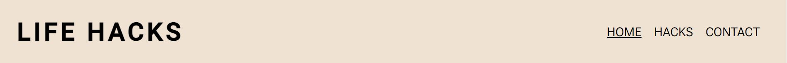

#### Landing Page Image
I chose this image for the landing page as I felt it set the tone of the site for the user instantly. The image portrays a person jumping across the air with the sunset in the background, creating a sense of tranqulity, tying in with the sites goal of making life eaiser for the user.


#### About section
The about section was included to allow the user to learn more about what the site is and the sites aims. Also included is a list of promises relating to the life hacks, so the user can feel confident that the life hacks on the site are genuinely useful, efficient and intutive, making the user want to read on. Next to each promise I have included a relevant icon for more visual effect.

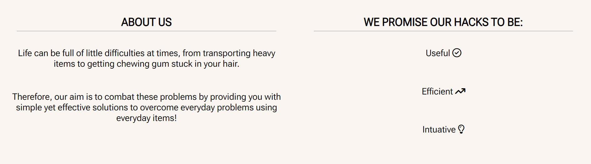

#### Life Hacks Section
Within the hacks page, I have included six everyday life hacks. For each life hack, there is a numbered title which sums up the life hack in a sentance for the user, a photo which is relevant to the life hack and text underneath the photo, which outlines the simple steps the user would need to take in order to try the life hack for themslves.

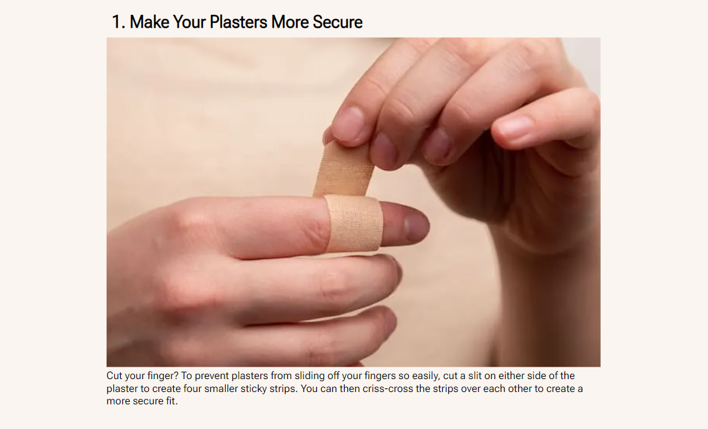

#### Contact Form
The contact form is included within the contact page. The primary goals of the form are to allow the user to contact me so they can share whether they thought my life hacks were useful or not and to also give the chance to the user to provide details of their own life hacks they implement within their own lives.

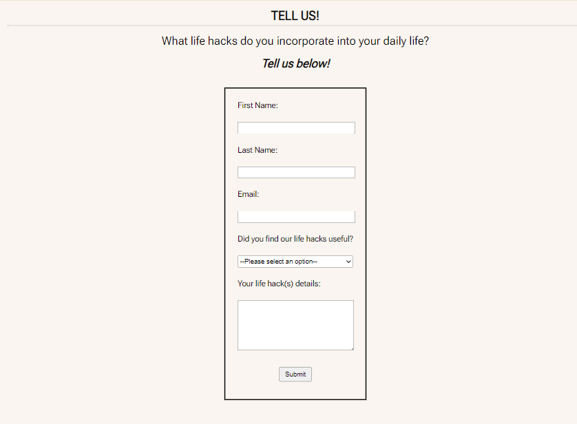

#### Thank You Page
If the user would like to fill out and submit the contact form, they will be redirected to the thank you page, as shown belown. 

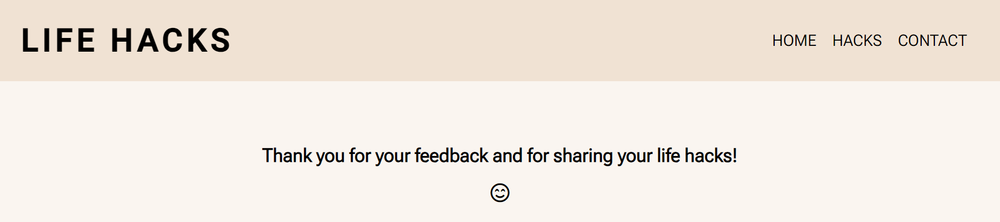

The thank you page was included to let the user know their responses have been acknowledged with a smiley face icon and a short sentace that gives thanks to the user for sharing their feedback and for sharing their own life hacks.

#### Footer
Just like the navigation bar, the footer is also implimented across all pages. The footer is always situated at the bottom of the page. Within the footer, I have included five social media icons that are linked to the corresponding social media website and when clicked, it will open the social media website in a new tab. I have included five social media platforms, as I wanted to give the user the choice of a wide range of social media platforms so they are more encouraged to keep connected.

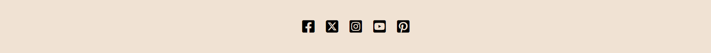

### Future Features
 - Include more life hacks that can be categorised and organised into a category menu
 - Add a video link with each life hack to demonstrate how to carry out the hack
 - Add a compilation video containing various other life hacks so the user can learn more hacks not mentioned on the site

# Testing
When building the life hacks page, I wanted to keep the life hacks in a column down the centre of the page for all screen sizes as it gave the desired look I wanted. In order to make this responsive for all screen sizes, I increased the size of the life hack title, photo and text within each media query, so when the screen size increases the life hack content increases accordingly too.

Once I had finished my contact form, I tested it out and realised that when I increased the size of the textarea input box, the submit button would be pused out of the border of the contact form. I tried to increase the height of the contact form but this didn't help. I also switched the textarea element and the select element around but the submit button would still be pushed out of the contact form container. Upon taking inspiration from a fellow Code Institute student [Paul Woods](https://github.com/pawoods), I added the following style rule

```
height: fit content;
```
to the contact form and this allowed the height of the contact form to fit in all the contact form elements, leaving no room for the submit button to be pushed put of the border.

When I ran the code of each html page through the W3C markup validator, the same warning appeared for nearly every page, which warned me that there were section elements that didn't include headings. To overcome this, I added a placeholder h2 element with text in every section element without a heading. I added the following style rule

```
.hide-heading {
    display: none;
}
```

to my css file and I added the following class 

```
class="hide-heading"
```
to each placeholder h2 element to hide the heading when viewed in the browser. This approach cleared the warning errors and didn't change the layout of the site.

Running my html code for the contact page through the W3C markup validator flagged an error that told me I needed to add a placeholder option label to my select element in my contact form, as the first child option element of a select element must have an empty value attribute or have no text. I wasn't sure how to go about this so I searched on google for more information regarding the select element. I found an article on MDN Web Docs that included a piece of code that had a placeholder option label. taking inspiration from this, I included a similar placeholder option label and added the hidden attribute so the user can not select the placeholder option as their answer in the dropdown list.

### Validator Testing
After fixing all warnings and errors as mentioned above, I ran all html and css files through their respective W3C validators and no issues were found

- No errors or warning in any of my html files:

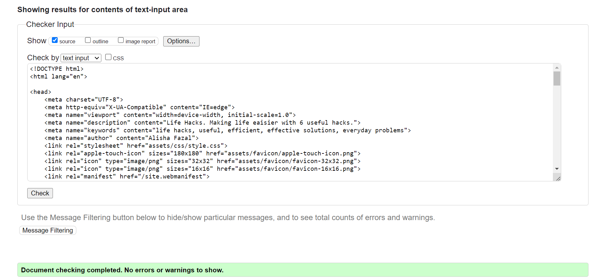

- No errors or warnings in my css file:

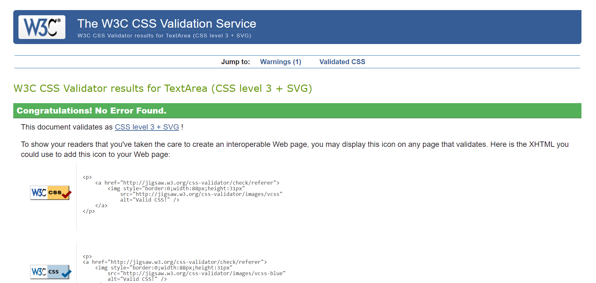

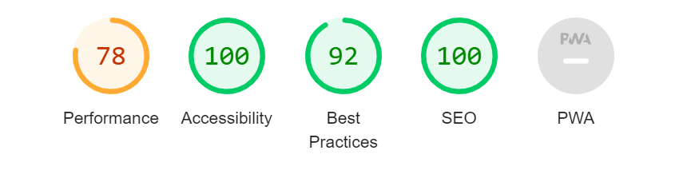

The above report generated from Lighthouse in DevTools shows the homepage score and all other pages had even greater scores. The accessibilty score is excellent across all pages.

### Further Testing
- I tested my site using Google Chrome, Microsoft Edge and Safari with no issues and it is responsive across different device screen sizes
- I asked friends to view my site on their devices and I recived positive feeback with only minor ammendments
- All links work as expected and social media links open in a new tab as expected

## Libraries and Programs Used
 - Favicon - To generate favicon image used in the browser tab
 - Font Awesome - All icons in the homepage, thank you page and social media icons in the footer
 - Google Fonts - To add Roboto and Roboto Flex fonts to the site
 - GitHub - Store project repository
 - GitPod - Cloud development environment allowing me to create all my html and css files
 - Coolors.co - Colour pallete generator
 - TinyPNG - Image compressor
 - Converter.co - Converted my images into .png and .webp formats
 - Am I Responsive? - Gave insight into the sites responsiveness
 - The W3C Markup Validator - A validator to check if my html files had any errors
 - The W3C CSS Validator - A validator to check if my css file had any errors

 ## Deployment
The site was deployed to GitHub pages using the following steps:

- In the GitHub repository, click on the "Settings" tab
- On the left hand side of the screen in the "Code and automation" section, click on the "Pages" tab
- In the "Build and deployment" section, select "Deploy from a branch" from the "Source" dropdown menu
- Under the "Branch" heading, select the "main" branch and "root" then press save.
- The page will automatically refresh and a link to the deployed website will appear

The link to my live site: https://alishafazal.github.io/life-hacks-project-1/

## Credits
### Content
- I took inspiration from the "Love Running" walkthrough project. Credit has been referenced in comments above the code in my html and css files to show which pieces I took specific inspiration from. I took inspiration specifically for: 
  - The design of the header
  - Navigation bar
  - Underline on the navigation links when the cursor hovers over 
  - Underline on the navigation link corresponding to the page the user is on
  - The width of the hero image
  - Wildcard selector
  - The design of the social media links in the footer
#
- This youtube video helped me greatly in furthering my knowledge on flexbox and how to apply the different flexbox properties to get the desired effect I wanted. The link to this video can be found [here](https://www.youtube.com/watch?v=phWxA89Dy94).

- I would like to give credit to Paul Woods, as I took inspiration from his css stylesheet which helped me keep my submit button from being pushed out of the contact form border when the textarea element was enlarged. I specifically took inspiration from the line of code on line 226 from this link found [here](https://github.com/pawoods/project1/blob/main/assets/css/style.css).

- This MDM Web Docs article helped me make sense of the error that was flagged when I ran my code for the contact.html page through the W3C Markup Validator. I took inspiration specifically from the beggining of the article in the very first html demo on the fourth line of code. The link to this article can be found [here](https://developer.mozilla.org/en-US/docs/Web/HTML/Element/select).

- I wasn't sure how to hide the placeholder option label in my select element, so after a google search, I came across this MDM Web Docs article that went into detail about the hidden attribute. I took inspiration from this article and used the hidden attribute in the placeholder option label to hide this as an option. The link to this article can be found [here](https://developer.mozilla.org/en-US/docs/Web/HTML/Element/input/hidden#value).

### Media
All media was sourced from [Unsplash](https://unsplash.com/)
 - Hero image - [Silhouette photo of man jumping on body of water during golden hour by Kid Circus](https://unsplash.com/photos/7vSlK_9gHWA)
 - Life hack image #1 - [Person with band aid on middle finger by Diana Polekhina](https://unsplash.com/photos/SwWjCbIIoFE)
 - Life hack image #2 - [Coke in some ice by James Yarema](https://unsplash.com/photos/fkSsKusLV0U)
 - Life hack image #3 - [man in black denim jeans and black leather shoes standing beside black luggage bag by Keith Pitts](https://unsplash.com/photos/5SWgIJSsVJo)
 - Life hack image #4 - [Variety of cooked foods by Kim Deachul](https://unsplash.com/photos/NOAzwcMzZJA)
 - Life hack image #5 - [Multicolored balls in clear shot glass by Marvin Meyer](https://unsplash.com/photos/pwQ-rAd8gjU)
 - Life hack image #6 - [Glass cup filled with ice latte on tabletop by Demi DeHerrera](https://unsplash.com/photos/L-sm1B4L1Ns)