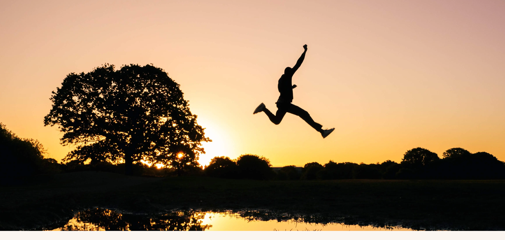

# Life Hacks
For this project, my aim was to create a site that provides users with useful life hacks that are intuitive and easy to follow. The intent of this site is to provide simple solutions to life's small difficulties and is intended for anyone who would like to learn these solutions in order to make their life eaiser.

<!--Add Am I Responsive image once done-->

# Table of contents
- [UX](#ux)
  - [Site Purpose](#site-purpose)
  - [Site Goal](#site-goal)
  - [Audience](#audience)
  - [Communication](#communication)

- [Design](#design)
  - [Wireframes](#wireframes)
  - [Colour scheme](#colour-scheme)
  - [Typography](#typography)
  - [Images](#images)

- [Features](#features)
  - [Existing features](#existing-features)
  <!-- - [Future features](#future-features)-->

# UX
### Site Purpose
To provide intutive and easy to follow life hacks for people to follow and test for themselves.

### Site Goal
To make life eaiser by providing useful solutions to common everday problems using everday items, so anyone can follow along.

### Audience
The target audience is for people aged 18-65, but is suitable for anyone who is interested in learning new everyday life hacks.

### Communication

# Design
### Wireframes
I sketched out my wireframes by hand so I could have a visual guide as to where I would place certain elements and to overall help me structure the site.
<!--Add wireframes photo-->

### Colour Scheme
As the main goal of the site is to make life eaiser, I decided to use shades of off-white and beige to give the site a feeling of calmness, peace and warmth to reflect this. I used [coolors.co](https://coolors.co/) to find the below colour pallete. 

I settled on using #FAF5F0 and #F0E2D3 in this pallete to create a clear contrast between the header, main body and footer. Because of my choice of background colours, I decided to colour the text and icons black (#000000) to provide clear contrast between them.

### Typography
[Google Fonts](https://fonts.google.com/) was used to source all fonts on the site. I chose to use Roboto as the font for the logo because I liked how clean-cut yet simple it is, aiding in the easy-going feel I wanted the site to have. For all other text, Roboto Flex was used. I feel like the two fonts compliment each other well and they are not distracting for the user.

### Images

All images on the site were taken from [Unsplash](https://unsplash.com/images). The hero image was chosen as it sets the tone of the site instantly for the user. For each life hack, I included a clear and relevant photo to demonstrate what the hack is about, aiding in user understanding.

# Features
### Existing Features
#### Navigation Bar
Implemented across all four pages, the navigation bar allows for users to easily switch between pages. The logo is also a clickable link which will take users back to the homepage. When users hover over the home, hacks and contact navigation links with their cursor, the subseqent link will become underlined, making the site more interactive for the user. The current page the user is on is also underlined to further indicate to the user which page they are viewing.

#### Landing Page Image
I chose this image for the landing page as I felt it set the tone of the site for the user instantly. The image portrays a person jumping across the air with the sunset in the background, creating a sense of tranqulity, tying in with the sites goal of making life eaiser for the user.

#### About section
The about section was included to allow the user to learn more about what the site is and the sites aims. Also included is a list of promises relating to the life hacks, so the user can feel confident that the life hacks on the site are genuinely useful, efficient and intutive, making the user want to read on. Next to each promise I have included a relevant icon for more visual effect.

#### Life Hacks Section
Within the hacks page, I have included six everyday life hacks. For each life hack, there is a numbered title which sums up the life hack in a sentance for the user, a photo which is relevant to the life hack and text underneath the photo, which outlines the simple steps the user would need to take in order to try the life hack for themslves.

#### Contact Form
The contact form is included within the contact page. The primary goals of the form are to allow the user to contact me so they can share whether they thought my life hacks were useful or not and to also give the chance to the user to provide details of their own life hacks they implement within their own lives.

#### Thank You Page
If the user would like to fill out and submit the contact form, they will be redirected to the thank you page, as shown belown. 

The thank you page was included to let the user know their responses have been acknowledged with a smiley face icon and a short sentace that gives thanks to the user for sharing their feedback and for sharing their own life hacks.

#### Footer
Just like the navigation bar, the footer is also implimented across all pages. The footer is always situated at the bottom of the page. Within the footer, I have included five social media icons that are linked to the corresponding social media website and when clicked, it will open the social media website in a new tab. I have included five social media platforms, as I wanted to give the user the choice of a wide range of social media platforms so they are more encouraged to keep connected.

